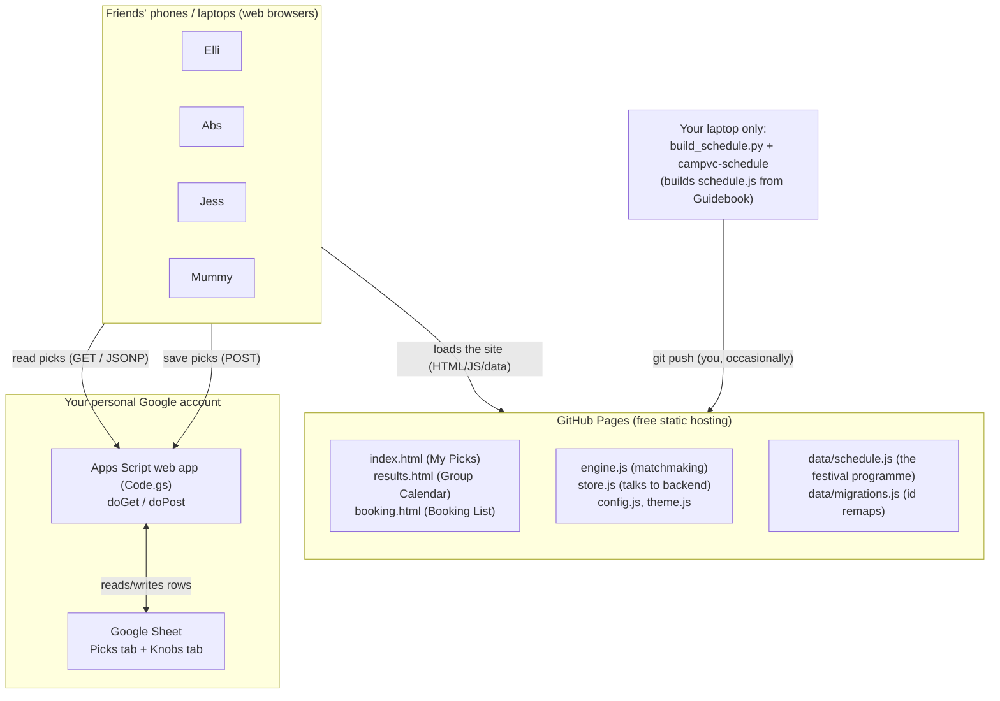
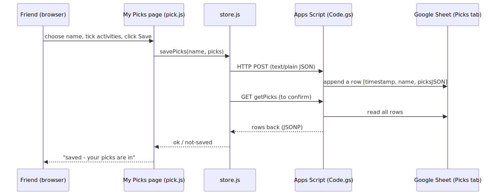
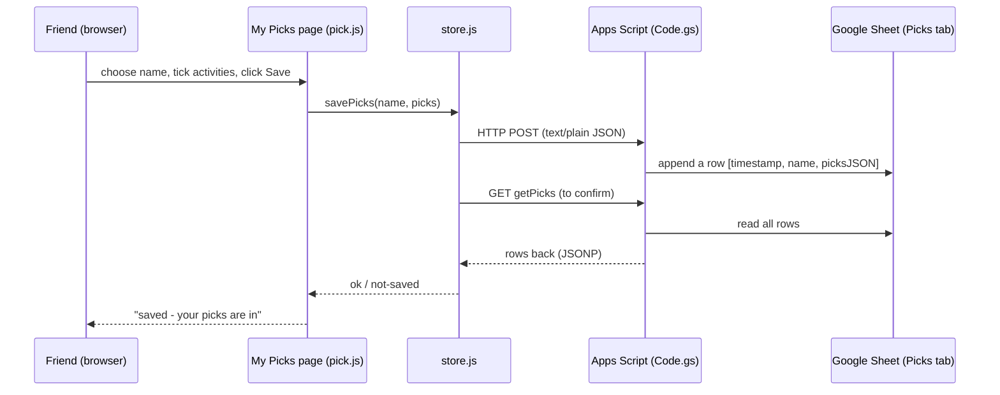
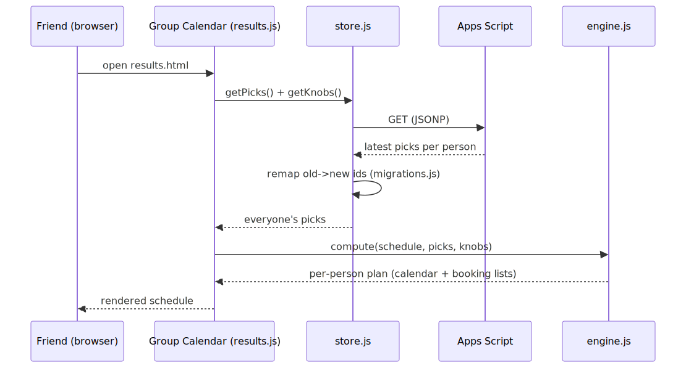
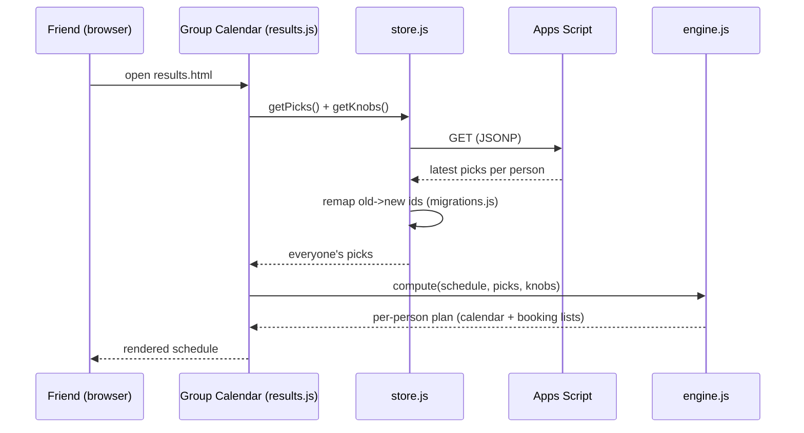

# Camp VC Planner - How It Works

A static website (no server of our own) talking to a Google Sheet that acts as the shared database.

## 1. The big picture (deployment / components)



<!-- Mermaid source for the diagram above (rendered to images/diagram-1.svg):

-->


ASCII fallback:

```
  Friends' browsers
        |   1) load website files          2) read/save picks
        v                                          |
  +-----------------------+                         v
  |  GitHub Pages         |              +------------------------+
  |  (free static host)   |              | Google Apps Script     |
  |  - the 3 HTML pages   |              | (Code.gs web app)      |
  |  - engine/store/config|              |  doGet  = read picks   |
  |  - data/schedule.js   |              |  doPost = save picks   |
  +-----------------------+              +-----------+------------+
        ^                                            |
        | git push (you, when updating)              v
        |                               +------------------------+
  +-----------------------+             | Google Sheet           |
  | Your laptop:          |             |  "Picks" tab           |
  | build_schedule.py     |             |  "Knobs" tab           |
  | (+ campvc-schedule)   |             +------------------------+
  +-----------------------+
```

**Key idea:** GitHub Pages only serves *files* - it can't store data. The Google Sheet (via Apps Script) is the shared *database*. Each friend's browser does the work (running the matchmaking engine locally) and just reads/writes picks to the Sheet.

## 2. Saving a pick (sequence)



<!-- Mermaid source for the diagram above (rendered to images/diagram-2.svg):

-->


## 3. Viewing the calendar (sequence)



<!-- Mermaid source for the diagram above (rendered to images/diagram-3.svg):

-->


## 4. Two things that are new to you

**GitHub Pages** = free website hosting straight from a GitHub repository. You `git push` your files; GitHub serves them at `https://ellishapiro.github.io/campvc-planner/`. There is no backend code running there - just static files.

**Google Apps Script** = a little JavaScript program (`Code.gs`) attached to a Google Sheet, published as a "web app" URL. When a browser hits that URL it runs your `doGet`/`doPost` functions, which read/write rows in the Sheet. It's effectively a tiny free API in front of the spreadsheet. It runs as *you* ("Execute as: Me") and is open to "Anyone" so friends don't need to log in.

## 5. Read vs write paths (why JSONP for reads, POST for writes)

| Action | How | Why |
|---|---|---|
| Read picks | `GET` via JSONP (`<script>` tag) | Reliable cross-origin reads from Apps Script |
| Save picks | `POST` with `text/plain` body | Avoids a CORS "preflight"; write lands even if the response can't be read, so store.js re-reads to confirm |

## 6. Where data lives

| Data | Lives in | Set by |
|---|---|---|
| Festival programme | `data/schedule.js` (in the repo) | `build_schedule.py` on your laptop, then `git push` |
| Friends' picks | Google Sheet "Picks" tab | Friends, via the My Picks page |
| Shared schedule tweaks (knobs) | Google Sheet "Knobs" tab | You, via the Adjust panel |
| Old→new id remaps | `data/migrations.js` (in the repo) | `build_schedule.py` |

A couple of clarifications for someone new to these:
- **Updating the website** (code or the festival programme) = edit files locally, then `git push` - GitHub Pages redeploys automatically in ~a minute. Nothing in the Google Sheet is affected.
- **Friends' picks** never go through GitHub at all - they go browser → Apps Script → Sheet. So you can redeploy the site freely without touching anyone's saved picks.
- The diagrams above are **deployment + sequence** views (UML-style). If you'd prefer a formal UML *class* diagram, there isn't much of a class hierarchy here - it's a few plain script modules (`engine`, `store`, page controllers) rather than objects - so component/sequence diagrams describe it far more usefully.

